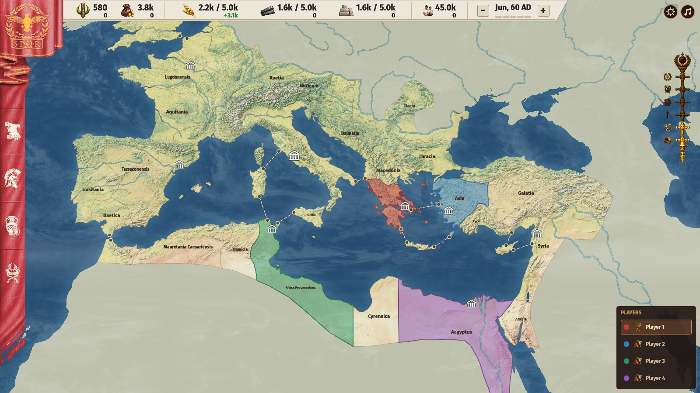
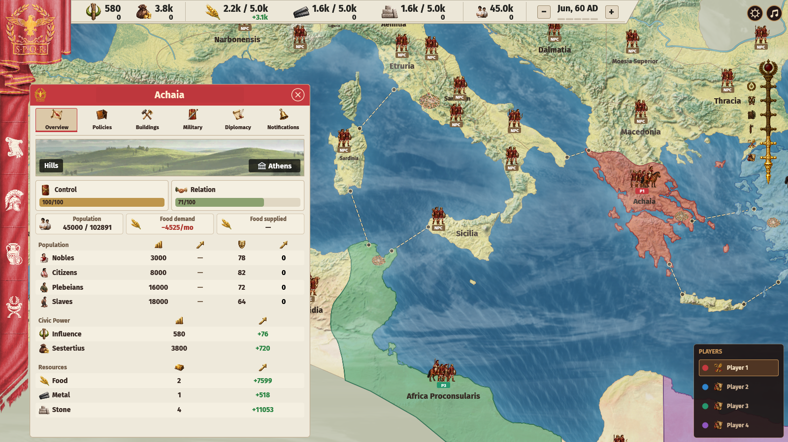
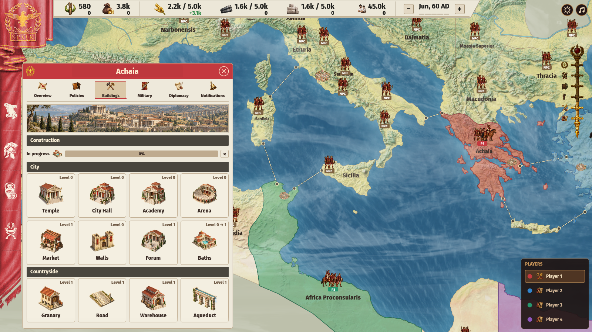
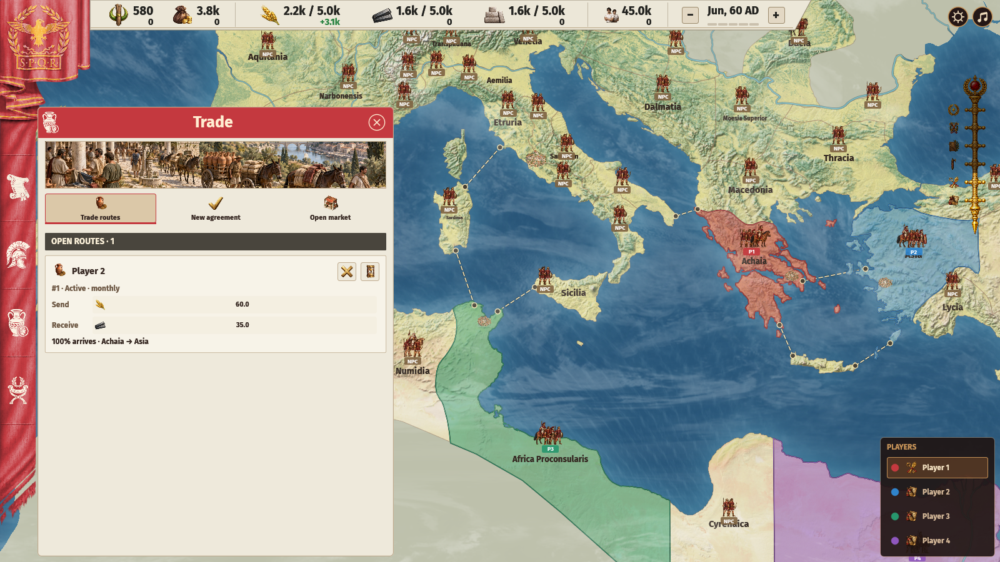
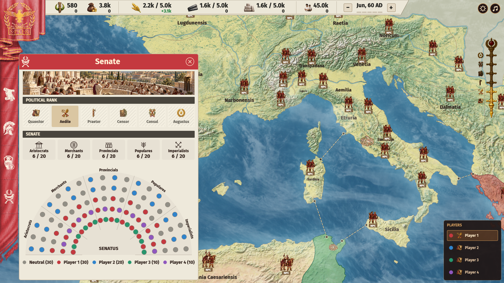
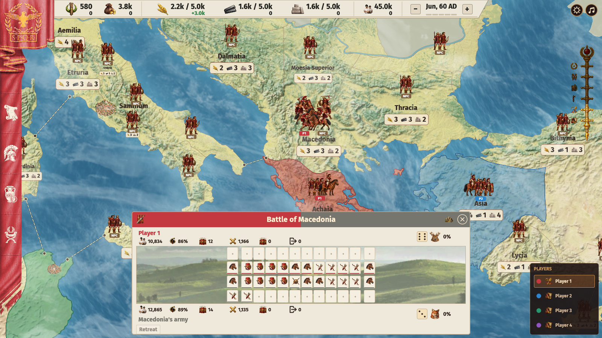

# Augustus
### A historical strategy game set in ancient Rome

  

  

 

## Gameplay

There are two ways to win:

- Become Augustus by advancing through the political ranks and securing Senate support.
- Conquer Rome by defeating its defenders.

Losing your last directly owned province eliminates you.

### Population and resources

Provinces contain Nobles, Citizens, Plebeians, and Slaves, each with their own happiness.
Births, deaths, and class changes occur monthly. Terrain, area, cities, and buildings determine
how many people can live comfortably in a province. Overcrowding reduces happiness and births.
Unhappy free people migrate to neighboring provinces with better conditions; relations,
cities, available space, and migration policy influence where they go. Slaves do not migrate freely.

| Resource | Use |
| --- | --- |
| Food | Feeds civilians and troops |
| Metal | Equips recruits and pays for construction |
| Stone | Pays for buildings and wonders |
| Sestertius | Pays wages, trade, diplomacy, spies, and bribes; comes from Citizen and Plebeian taxes, tribute, and sales |
| Influence | Pays for promotions and political actions; comes from Nobles, buildings, wonders, ranks, and vassals |

Plebeians and Slaves produce goods. Geography and Resource Focus determine how workers are
allocated; Slaves produce more per worker. Owned provinces share stockpiles and storage
capacity. Excess goods are discarded; Sestertius and Influence have no storage limit.

Food shortages affect civilians and troops proportionally, lowering happiness and births,
causing famine deaths, and reducing army morale. Slave revolts remove the local slave
population and raise hostile Light Infantry. Rebels fight any garrison and reduce political
Control if left unopposed.

### Policies and events

Food Rations affect consumption, happiness, and population growth. Slave Labor trades
productivity against Slave happiness and mortality. Noble Wages affect Noble happiness;
Army Wages affect morale. These policies apply nationwide, including newly acquired
provinces. Vassals keep their own domestic policies. If the treasury runs dry while expenses
exceed income, Noble happiness and army morale fall, and spies flee.

Each owned province also sets:

- Resource Focus: allocate workers toward Food, Metal, Stone, or a balanced mix.
- Construction Pace: divert more Slave labor from production to finish projects faster.
- Migration Focus: change arrivals, departures, and happiness.
- Civic Spending: pay for the happiness of free people.
- Recruitment Effort: balance recruitment speed against expense and local happiness.
- Manumission: free Slaves into Plebeians at a Noble happiness cost, or enslave Plebeians at a Plebeian happiness cost.

Theater improves Citizen happiness, Feasts help Nobles, Games help Plebeians, and Grain
Doles help Plebeians and Slaves. Patronage exchanges Influence for Sestertius. Event costs
scale with the population benefiting; happiness gains fade. Each event has a 24-month cooldown.

### Buildings and wonders

Granaries store Food, Warehouses store Metal and Stone, Roads improve travel and trade,
and Aqueducts increase population capacity. Cities can also build Forums for Influence,
Baths for capacity and happiness, Markets to attract migrants, Temples and Academies for
happiness and Influence, Arenas for happiness, Walls for defense, and City Halls for taxes.

Each province builds one project at a time and can hold 10 construction orders, independently
of recruitment. Stone and Metal are paid upfront. Cancelling a waiting order refunds its
cost; cancelling active work does not. Upgrades have no fixed limit: benefits grow linearly,
while costs and time rise exponentially. Capture preserves active work but clears waiting orders.

Wonders can be built at historical sites. They grant Influence on completion and each month
to the direct owner. Assigned Slaves accelerate construction with diminishing returns;
they still need Food and stop producing goods. Capture resets their assignment.

### Diplomacy and territory

Relation measures friendship; Control measures political power. Independent provinces divide
100 Control among local authorities and players. Rival players can also contest owned
provinces. Spending Sestertius or Influence, recurring support, trade, and stationed troops
build your position. Distance and opposition increase costs. Interference can weaken rival
relations, Control, or civilian happiness. Noble bribery grants random Control with a risk
of scandal; insults damage Relation. Each action is available once per year.

More than 50 Control with a unique lead permits vassalization. The vassal's starting Control
is your previous share minus 50. Vassals provide Influence and adjustable tribute, but no
ordinary production or wonder income. High tribute damages relations; poor relations erode
Control, while support and garrisons sustain it. At zero Control, a vassal becomes independent.
At 100, integrate a province for direct ownership; Relation determines its initial happiness change.

Attacking declares hostility and engages defenders on arrival. Victory establishes occupation
and subsequent Control gains. Ordinary provinces still require political conversion for
ownership, and occupation blocks the displaced owner's management.

Pressure enters independent territory without fighting its defenders. It gains up to
2 Control per month, reduced by resistance, with a ceiling of 40, and costs 3 Relation monthly.
Leaving ends pressure. If Relation falls below 50, local defenders may attack.

### Trade

Trade goods and Sestertius through monthly or one-time agreements. Deals between players
need both parties' approval. Provincial governments set terms according to needs, scarcity,
relations, and budget. Transport loses goods along the route; Roads reduce losses, while
hostile territory can block delivery.

Recurring provincial trade improves Relation and builds Control up to 40. One-time deals
grant no Control. Established provincial routes can reduce both sides' deliveries when at
least 80% can be supplied; new deals need full supply. Failed routes suspend, resume when
viable, and cancel after three consecutive failures. Six months' notice avoids cancellation
penalties. Breaking an established route immediately costs Relation, Influence, and Merchant support.

The open market buys or sells Food, Metal, and Stone immediately. Prices worsen with your
cumulative monthly volume, even if you split orders, and reset each month. Purchases require
Sestertius and storage. Market exchanges grant no Relation or Control.

### Espionage

Spies can gain Control, improve relations, uncover scandals, undermine opponents, support
Slave revolts, or discredit rivals. Deployment costs Influence; monthly upkeep costs
Sestertius. Distance increases both costs, and missions risk detection. Recall takes six
months; immediate flight carries greater risk.

Evidence can be spent once for eligible provincial Control, Relation, or temporary trade
advantages, or exposed to reduce a rival's Senate support. Severity determines the loss
of confidence in the affected factions. Discovered evidence remains until used. Public
scrutiny lasts a year; lost support must be earned again.

### Senate and political ranks

The Senate has 100 senators, initially neutral, divided equally among five factions.
Conditions in your provinces and your actions build confidence monthly, filling neutral
seats before competing with rivals. Poor conditions reduce it. Exact confidence is hidden.

| Faction | Preferences |
| --- | --- |
| Aristocrats | Happy Nobles, higher office, Forums, and wonders |
| Merchants | Net monthly income above 30 Sestertius and delivered recurring trade; shortages and war hurt support |
| Provincials | Vassals, good relations, and rural trade; high tribute and war hurt support |
| Populares | Happy Citizens and Plebeians, Food reserves, and supplied generous rations; shortages and harsh labor hurt support |
| Imperialists | Trained armies, military ranks, victories, and territorial Control beyond the first province |

You can petition senators, send gifts, offer patronage, bribe, threaten, murder, host
banquets, discredit their patrons, or lobby. Personal goodwill builds gradually and fades;
bribery and lobbying require continued payments. Each player can maintain one ongoing
action per senator alongside temporary actions. Risky actions may be exposed. Murder
replaces a senator with a neutral newcomer and clears every player's progress in that seat.

The political ladder is Quaestor → Aedile → Praetor → Censor → Consul → Augustus.
Successive promotions cost 500, 1,000, 1,500, 2,000, and 3,000 Influence, plus enough
supporters. Promotions are immediate, limited to one per month, and retain supporters.
Required support scales with player count: 10, 20, 30, 40, and 60 senators in solo or
two-player campaigns. Augustus always requires at least 51. Consul is a permanent rank.
Rome begins with 50 defending cohorts; military conquest requires no political rank.

### Armies and movement

Recruit 1,000-person cohorts in owned provinces using Citizens or Plebeians and Metal.
Available units are Light and Heavy Infantry, Archers, Light and Heavy Cavalry, Horse
Archers, War Chariots, War Camels, War Elephants, Ballistae, and Catapults. Specialist mounts
require local traditions. Drafting lowers happiness. Each province recruits one cohort at
a time with 13 waiting orders. Waiting cancellations refund recruits and Metal; active
cancellations do not.

Surviving troops consume Food and wages monthly. Owned provinces feed hosted armies;
the army owner pays wages. Supplied cohorts gain Training monthly and recover strength and
morale outside battle. Destroyed cohorts stay lost. Merge damaged cohorts of the same type to
concentrate their strength; disbanding in owned territory returns survivors to their original class.

The military ladder is Centurion → Tribune → Legate → Imperator, separate from political
office. Promotions cost Influence and require peak army size and victories. Higher ranks
improve morale, recovery, Influence income, and the political strength of garrisons.

Armies can split into detachments, move, defend, attack, or apply pressure. Travel depends
on the slowest selected unit, province size, terrain, Roads, and land or sea crossings.
Peaceful passage through independent territory requires 60 Relation; stationing requires
80. Your vassals permit access, while other players grant it per province. Permission is
checked again during travel.

### Combat

A Battle Plan sets preferred Frontline, Rear line, and Flank unit types, 1-5 slots per wing,
and a tactic. Plans can change while marching but lock when battle begins. Deployment is
automatic: preferred units fill the wings and center, while Rear line units are held back
when possible and favored as replacements. Missing types use alternatives. Stronger cohorts
of the same type deploy first; surviving deployed units keep their positions.

Terrain limits each front and support row to 16 slots in Farmland or Plains, 14 in Desert,
12 in Hills, 10 in Forest, and 8 in Mountains or Marsh. Each wing is limited to one third
of the width. Small armies form a centered line; extra cohorts wait in reserve. Reserves
and reinforcements fill destroyed or routed slots, so a larger army cannot attack with
every cohort at once.

Units attack the nearest enemy front slot within their Maneuver reach, favoring aligned
targets. Mobile cavalry reaches farther sideways and can exploit uneven lines. A unit
without a reachable target cannot attack. Archers and artillery can fight from support
slots: a cohort directly ahead protects them, but they attack at 50% effectiveness.
Uncovered support becomes targetable after reachable front targets are exhausted and takes
50% more casualty and morale damage. Support troops forced into the front are also exposed.

Each tactic counters two others, loses to two, and is neutral against one:

| Tactic | Counters | Suitable troops |
| --- | --- | --- |
| Shock Action | Envelopment, Skirmishing | Heavy Infantry and Cavalry, Elephants |
| Envelopment | Deception, Phalanx | Cavalry, Horse Archers, Camels |
| Skirmishing | Bottleneck, Envelopment | Archers, Horse Archers, Light Infantry |
| Deception | Skirmishing, Bottleneck | Horse Archers, Chariots, mobile cavalry |
| Bottleneck | Shock Action, Phalanx | Heavy and Light Infantry |
| Phalanx | Shock Action, Deception | Heavy Infantry, Elephants |

Countering adds up to 20% attack, or 25% for Phalanx, depending on how well your surviving,
unrouted troops fit the tactic, weighted by remaining manpower. A Shock Action army with
50% fit gains 10% attack when countering. Being countered reduces attack by 10%; neutral
matchups give no bonus. Selecting preferred unit labels does not improve fit. Enemy
Training and plans are hidden before battle; participants can see both locked formations
and tactics once fighting begins.

Both sides deal damage simultaneously each round. Attack depends on offense, surviving
manpower, unit matchups, tactics, Training, morale, military rank, support position, and
a shared six-sided die per side, giving a 0.90-1.10 multiplier. Target defense and Training
resist both casualties and morale loss. Matchups favor Heavy Infantry against Light Infantry,
cavalry against Archers, and Horse Archers against Heavy Infantry. Walls add 5% defense per
level, capped at 30%; deployed Ballistae and Catapults suppress part of that bonus.

Training improves attack and defense; falling morale reduces attack output. Below 20 morale,
a cohort routs and cannot return to that battle. Reserves replace it. Shortages and unpaid
wages weaken readiness; zero-morale cohorts disband. A side loses when all its cohorts are
destroyed or routed.

Retreat requires one completed battle month and a legal escape route. Ordinary attackers
lose after three months without victory. Trapped troops cannot rout or retreat, and trapped
attackers bypass the deadline. Rome's defenders also ignore routing and the deadline;
they must be destroyed.

Combat runs four rounds per month, 0.75 seconds apart at normal speed. Pausing and speed
changes apply to battles too. Surviving participants gain experience; victories grant
Renown, career victories, and Imperialist support, while defeats reduce support.

 

### Mouse + Key bindings

- `Esc`: Close the current dialog or panel, or enter/exit the in-game menu.
- `Enter`: Submit a menu form, select the first search result, or continue from the in-game menu.
- `Space`: Pause/resume play, or continue from the in-game menu.
- `Ctrl + Left / Right`: Decrease/increase game speed; changing speed resumes play.
- `W-A-S-D`: Move the map.
- `Left drag`: Pan the map.
- `Scroll`: Zoom the map around the cursor.
- `Left click`: Inspect a province, city, army, or battle.
- `Right click`: Open destination orders for the selected army.
- `Mouse back / forward`: Cycle tabs in the open province panel.

In multiplayer, only the host can pause or change speed.
